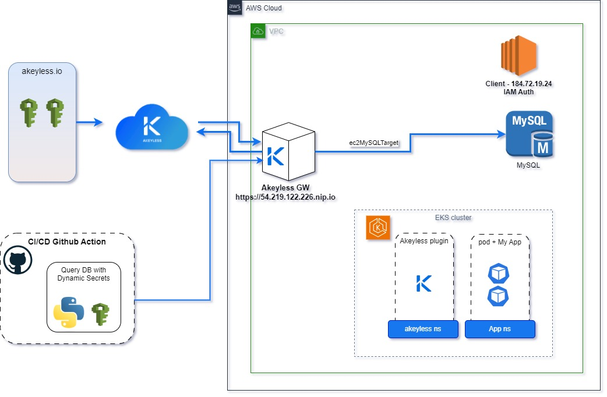
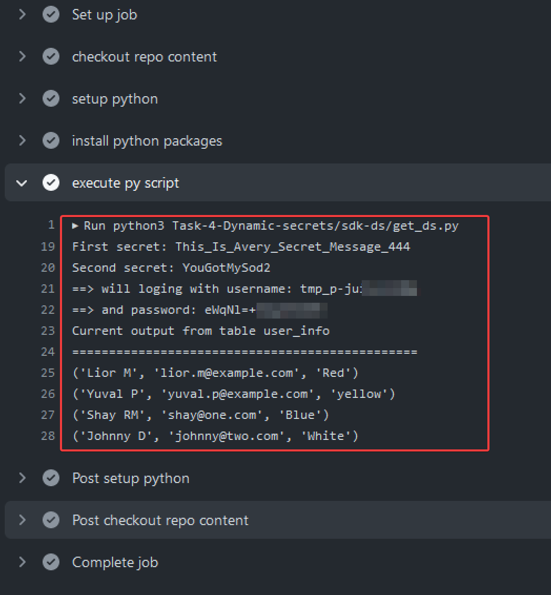

# akey-demo
Demo with Akeyless technology and DFC (Disterbuted Fragment Cryptogrphy) 

## Theory 

Answering some theoretical questions before demo description.

## UI management and features

#### 1. What are Authentication Methods?
   An Authentication Method is the mechanism that a human or machine uses to prove they are who they say they are in order to access a service. In our case we're talking about accessing secrets. 
   Workloads and humans interact with Akeyless using various methods including the web console, browser extension, CLI, or SDKs.
   
#### 2. What are Access Roles?
   * Akeyless Role-based Access Control (RBAC) follows the **least privilege** principle to limit access rights for machines/human users 
     to the bare minimum of permissions they need to perform their work.
   * Access Roles can be configured to grant permissions on Secrets & Encryption Keys, Targets, Authentication methods and Access Roles, 
     you can also control user access to audit logs, analytics, Gateways settings and Secure Remote Access (SRA) information.

To set permission for a user to work with any item in the Platform, an appropriate Access Role must be assigned to the Authentication Method that represents this user. 
By default, users don't have any permissions in Akeyless unless explicitly granted.

We associate specific clients with a certain Authentication Method to an Access Role to increase operational flexibility. 
The user can define any number of roles with permissions per each role.


#### 3. What kind of Secrets can be created?
   Akeyless enables you to work with the following secret types.
   (more information could be found in the official [documents](https://docs.akeyless.io/docs/manage-your-secrets-overview))

   **Static Secrets:** 
   Key/value pairs that you create and update manually. The values usually remain the same for long periods. 
   
   **Dynamic Secrets:** 
   Temporary credentials generated on-demand to provide a client with access to a resource for a limited period of time, with a limited set of permissions.
   
   **Rotated Secrets:** 
   Passwords for privileged-user accounts that are periodically updated by resetting a password on a target machine. 
   The Akeyless Platform stores the updated secret value to retrieve it when required.
   
   In addition, Akeyless enables you to work with:
   **Targets:** 
   Targets act as a connector between credentials and the items that need to utilize them, both saving time for the user and protecting your flows from credential breakage. For more detail, see Targets.
   
   **Encryption Keys:** 
   AES, RSA, or EC keys of various sizes. Use these keys to encrypt secrets or any other kind of data and also to sign binaries or application transactions. See Encryption Keys.
   
   **Certificates:** 
   Akeyless acts as a Certificate Authority for the internal environment. Supporting both types of PKI/TLS Certificates and SSH certificates.


## System Architecture

For this task the following Cloud architecture was build:



## Fetching a Static secret
This task includes:

a. Create a new token/api-key (auth method)
b. assign it to a new Access Role with read+list permissions for the ‘MySecret’ you’re fetching.

Run the scripts in [Task -2](./Task-2-Static-secrets/)

## Fetching Dynamic Secrets

Create and fetch a Dynamic Secret (SQL-DB) within a simple code example (SDK) or Jenkins (or any CI/CD)

a. Authenticate to the vault using a cloud identity (i.e., aws-iam, azure identity) 

b. You may choose to use an aws-lambda or other serverless function


The git action file created to run python script that get the dynamic secrets and query MySQL server for information.





The following action file was used:

```yaml 
name: demo Akey SDK and Dynamic Secrets

on:
  workflow_dispatch:
    ##############################
    # inputs var
    #############################
    inputs:
      aws_region:
        description: 'AWS default region'
        type: string
        required: true
        default: us-east-1
      akey_host:
        description: 'Main Akey host'
        type: string
        required: true
        default: "https://api.akeyless.io"
      
      akey_gateway:
          description: 'Main Akey gateway'
          type: string
          required: true
          default: "https://54.219.122.226.nip.io"
      db_host:
          description: 'db host name'
          type: string
          required: true
          default: "54.241.82.232"

      db_name:
          description: 'Database name'
          type: string
          required: true
          default: "akey_database"

      db_table:
          description: 'Table name'
          type: string
          required: true
          default: "user_info"
          
######################
# Jobs
######################
env:
  WORK_DIR: "Task-4-Dynamic-secrets/sdk-ds"

jobs:
  build-and-run:
    runs-on: ubuntu-latest
    steps:

      - name: checkout repo content
        uses: actions/checkout@v2 #
            
      - name: setup python
        uses: actions/setup-python@v4
        with:
          python-version: '3.9' # install the python version needed
          
      - name: install python packages
        run: |
          python -m pip install --upgrade pip
          pip install -r ${{ env.WORK_DIR }}/requirements.txt     
          python -m pip install mysql-connector
                    
      - name: execute py script # run main.py
        id: run_py
        env:
          access-id: ${{ secrets.AKEYLESS_ACCESS_ID }}
          access-key: ${{ secrets.AKEYLESS_ACCESS_KEY }}
          akey_host: ${{ inputs.akey_host }}
          akey_gateway: ${{ inputs.akey_gateway }}
          db_host: ${{ inputs.db_host }}
          db_name: ${{ inputs.db_name }}
          db_table: ${{ inputs.db_table}}

        run: |
          python3 ${{ env.WORK_DIR }}/get_ds.py 
```


## Kubernetes Plugins

More information and reference found in [K8s plugin page](https://docs.akeyless.io/docs/kubernetes-plugins)
And in the [tutorial](https://tutorials.akeyless.io/docs/injecting-secrets-into-a-kubernetes-cluster) page

Use a K8s application pod and a Sidecar pod (plugin) to fetch a secret from the secrets management solution within a Kubernetes Container.

Code and reference files could be found in [Task 5](./Task-5-k8s-plugin/) directory


### Task execution

The following commands were run on the Akeyless gateway.

1. Create service_account and role binding in the K8s cluster.
   With `system:auth-delegator` `ClusterRole` that allows delegated authentication and authorization checks. Which is commonly used by add-on API servers for unified authentication and authorization.
   save and `kubectl apply` the yaml file 

   ```yaml
   
   apiVersion: v1
   kind: ServiceAccount
   metadata:
     name: gateway-token-reviewer
     namespace: akey   # Default namespace could be used as well
   ---
   apiVersion: rbac.authorization.k8s.io/v1
   kind: ClusterRoleBinding
   metadata:
     name: role-tokenreview-binding
     namespace: akey
   roleRef:
     apiGroup: rbac.authorization.k8s.io
     kind: ClusterRole
     name: system:auth-delegator
   subjects:
   - kind: ServiceAccount
     name: gateway-token-reviewer
     namespace: akey
   
   ```

2. Create secret for the service account token with annotation to the gateway service account 
   Save and apply the yaml file:

   ```yaml
   apiVersion: v1
   kind: Secret
   metadata:
    name: gateway-token-reviewer-token
    namespace: akey
    annotations:
      kubernetes.io/service-account.name: gateway-token-reviewer
   type: kubernetes.io/service-account-token   
   
   ```

3. Extract the service account JWT Bearer Token and save it as an environment variable:

  ```shell
  SA_JWT_TOKEN=$(kubectl get secret gateway-token-reviewer-token \
    --output 'go-template={{.data.token | base64decode}}')
  ```

4. Extract K8s Cluster CA Certificate
   Extract the K8s cluster CA certificate used to talk to Kubernetes API and save it as an environment variable with the following command:
   
   ```shell
   CA_CERT=$(kubectl config view --raw --minify --flatten  \
    --output 'jsonpath={.clusters[].cluster.certificate-authority-data}')
   ```

5. create k8s authentication method

   ```shell
    akeyless create-auth-method-k8s -n my-k8s-auth-method \
    --bound-pod-names mypod1 \
    --bound-pod-names mypod2 --bound-namespaces akey --json
   
   ```

   The output will include a new ACCESS ID and Private Key which will be used as `$ACCESS_ID` and `PRV_KEY` parameters:

    ```shell
    ACCESS_ID="p-8mo8........ykm"
    
    PRV_KEY="LS0tLS1CRUdJTiBSU0EgUF...
    ...
    ...
    ...
    ...
    VktLS0tLQo="
   ```
  
  > [!CAUTION]
  > Make sure you copy the "=" sign at the end the private key.


6. Create Kubernetes Auth Config on your Gateway
  Open a new tab and run the following command to start the server which allows access to the Kubernetes API server from within a cluster:

  ```shell
  kubectl proxy --api-prefix=/k8s-api
  ```
  Next, extract the Kubernetes OIDC Issuer saved as an environment variable.

  ```shell
  K8S_ISSUER=$(curl -s http://localhost:8001/k8s-api/.well-known/openid-configuration | jq -r .issuer)
  ```

7. Create k8s authentication config for the gateway. 

    ```shell
    akeyless gateway-create-k8s-auth-config  --name k8s-conf \
    --gateway-url  https://54.219.122.226.nip.io \
    --access-id $ACCESS_ID \
    --signing-key $PRV_KEY \
    --k8s-host https://79A20081870AAEE59072BC1837340896.gr7.us-west-1.eks.amazonaws.com \
    --token-reviewer-jwt $SA_JWT_TOKEN \
    --k8s-ca-cert $CA_CERT \
    --k8s-issuer $K8S_ISSUER

    ```

8. Install the Injector
   
   Get helm repo
   
   ```shell
   helm repo add akeyless https://akeylesslabs.github.io/helm-charts
   helm repo update

   ```
   
  create and update values.yaml file
  ```shell
  helm show values akeyless/akeyless-secrets-injection > values.yaml
  ```
  
  edit values.yaml file

  ```shell

  AKEYLESS_URL: "https://vault.akeyless.io"
  #AKEYLESS_ACCESS_ID: "<your-k8s-auth-method-access-id>"
  AKEYLESS_ACCESS_ID: "p-8mo8oxm1btaykm"
  AKEYLESS_ACCESS_TYPE: "k8s"
  #AKEYLESS_K8S_AUTH_CONF_NAME: "<your-k8s-conf-name-in-the-gateway>"
  AKEYLESS_K8S_AUTH_CONF_NAME: "k8s-conf"
  AKEYLESS_API_GW_URL: " https://54.219.122.226.nip.io:8088"

  ```
    
  K8s cluster, create and label a namespace for Akeyless (if it was not already created).
  
  ```shell
  kubectl create namespace akeyless
  kubectl label namespace akeyless name=akeyless

  ```
  

9. install helm

    ```shell
    helm install aks akeyless/akeyless-secrets-injection --namespace akeyless -f values.yaml
    ```

    The Create the init Container and Inject a Secret at Runtime

    ```shell
    cat << EOF > pod_to_get_secret.yaml
    apiVersion: apps/v1
    kind: Deployment
    metadata:
      name: test
    spec:
      replicas: 1
      selector:
        matchLabels:
          app: hello-secrets
      template:
        metadata:
          labels:
            app: hello-secrets
          annotations:
            akeyless/enabled: "true"
        spec:
          containers:
          - name: alpine
            image: alpine
            command:
              - "sh"
              - "-c"
              - "echo $MY_SECRET && echo going to sleep... && sleep 10000"
            env:
            - name: MY_SECRET
              value: akeyless:/dev/projects/test-aky/MySod1
    EOF
    ```
  
  for sidecar container:

  ```shell

  cat << EOF > sidecar.yaml
  apiVersion: apps/v1
  kind: Deployment
  metadata:
    name: test-file
  spec:
    replicas: 1
    selector:
      matchLabels:
        app: file-secrets
    template:
      metadata:
        labels:
          app: file-secrets
        annotations:
          akeyless/enabled: "true"
          akeyless/inject_file: "/dev/projects/test-aky/MySod1|location=/secrets/secretsVersion.json"
          akeyless/side_car_enabled: "true"
          akeyless/side_car_refresh_interval: "30s"
          akeyless/side_car_versions_to_retrieve: "2"
      spec:
        containers:
        - name: alpine
          image: alpine
          command:
            - "sh"
            - "-c"
            - "cat /secrets/secretsVersion.json && echo going to sleep... && sleep 10000"
  EOF
  ```
